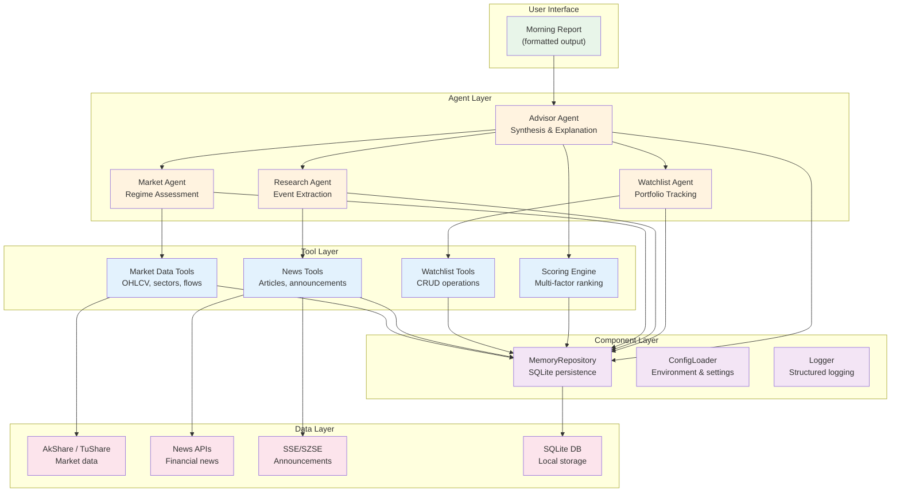
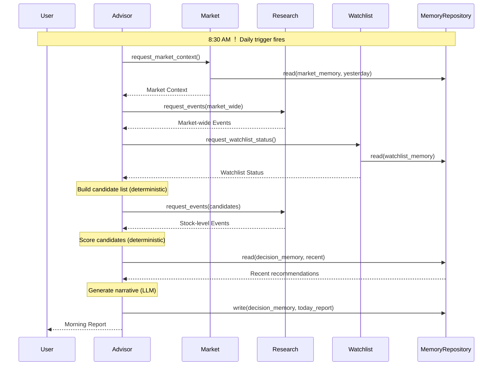

# System Overview ！ AI Investment Mentor

This document describes the high-level architecture of the AI Investment Mentor system: what layers exist, how they communicate, and how a user request flows through the system.

## Architecture Layers

The system is organized into five layers. Each layer depends only on the layer directly below it:

## Layer Descriptions

### User Interface
The user sees a formatted morning report. In V1, this is a text file or terminal output. The UI layer is intentionally minimal ！ the system is an analytical engine, not a web application. Future phases may add a web dashboard (V2).

### Agent Layer
Four specialist Agents plus one Advisor Agent that orchestrates them. Each Agent owns one domain of intelligence. Agents communicate through structured JSON ！ no Agent calls another Agent directly. The Advisor is the only Agent that initiates work.

| Agent | Responsibility | Triggers |
|---|---|---|
| Market Agent | Assess market regime, sector momentum, macro conditions | Daily schedule |
| Research Agent | Extract and classify news, announcements, policy events | On-demand (candidate list) |
| Watchlist Agent | Track user-curated watchlist, generate alerts | Daily schedule |
| Advisor Agent | Orchestrate all agents, score candidates, generate morning report | Daily schedule |

### Tool Layer
Tools are the capabilities Agents can invoke. Each Tool wraps one external operation ！ fetching data, summarizing text, writing to storage. Tools are stateless: they do not remember anything between calls. That job belongs to the Component Layer.

Key design rule: **Agents decide what to do. Tools execute the how.** An Agent never opens a network connection or writes a file directly.

### Component Layer
Infrastructure that persists across Agent invocations. Components are deterministic, have no LLM access, and provide the foundation services every Agent depends on.

| Component | Purpose |
|---|---|
| MemoryRepository | Read/write all three memory types via SQLite |
| ConfigLoader | Load environment variables and configuration files |
| Logger | Structured logging for debugging and audit trails |

### Data Layer
External data sources. The system never assumes a data source is available ！ every call is wrapped with timeout, retry, and degradation logic.

| Source | Provides | Protocol |
|---|---|---|
| AkShare / TuShare | OHLCV, fundamentals, sector data, capital flows | Python library / REST API |
| News APIs | Financial news articles | REST API |
| SSE/SZSE | Company announcements, filings | Web scraping / API |
| SQLite | Local persistence for all memory types | Local file |

## Communication Patterns

### 1. Agent ★ Tool
Synchronous call-return. Agent invokes a tool by name and receives structured data back. Tools do not know which Agent called them.

### 2. Agent ★ Component
Synchronous call-return. Agent reads/writes memory through the MemoryRepository Component. Components present a clean Python interface ！ the Agent never writes SQL.

### 3. Agent ★ Agent
There is no direct Agent-to-Agent communication. The Advisor Agent orchestrates: it calls Market Agent, receives Market Context, then passes relevant parts to Research Agent as parameters. Specialist Agents never call each other.

### 4. Tool ★ Data Layer
Synchronous with timeout (default: 30 seconds) and one automatic retry. If the data source is unavailable, the Tool returns a degradation flag rather than throwing an exception.

## Data Flow: Morning Report Generation

## Invariants (Must Always Hold)

1. **No layer-skipping.** An Agent in the Agent Layer cannot call a Tool in the Tool Layer that bypasses the Component Layer and directly accesses the Data Layer. All persistence goes through MemoryRepository.

2. **Structured inter-Agent communication.** No Agent receives unstructured text from another Agent and is expected to parse meaning from it. All inter-Agent data is typed and validated.

3. **Advisor is the sole orchestrator.** Only the Advisor Agent initiates multi-step workflows. Specialist Agents respond to requests; they do not self-trigger.

4. **Degradation over failure.** When a layer below fails, the layer above receives a degradation signal ！ not an exception. The system continues with reduced capability rather than stopping.

## Configuration & Environment

All configuration is externalized. No secrets, API keys, or environment-specific values are hardcoded.

- **Environment variables**: API keys, database path, log level, LLM provider
- **Configuration file** (`config.yaml` or `.env`): Agent weights, scoring thresholds, schedule timing
- **Code constants**: Only values that are definitionally constant (e.g., `SHANGHAI_COMPOSITE_INDEX_CODE = "000001"`)

## Technology Stack (V1)

| Component | Technology | Rationale |
|---|---|---|
| Language | Python 3.11+ | LangGraph ecosystem, AkShare/TuShare support, rapid prototyping |
| Database | SQLite (via aiosqlite or sqlite3) | Zero-config, single-user, embedded ！ perfect for a personal tool |
| LLM Provider | DeepSeek API (OpenAI-compatible) | Model-agnostic: works with GPT, Claude, or local models |
| Data | AkShare (primary), TuShare (fallback) | Free, active maintenance, A-share coverage |
| Orchestration | Python native (V1), LangGraph (V2, Phase 12+) | Start simple, adopt framework when complexity demands it |
| Logging | Python `logging` with structured output (JSON Lines) | Debuggable, machine-parseable, standard library |

