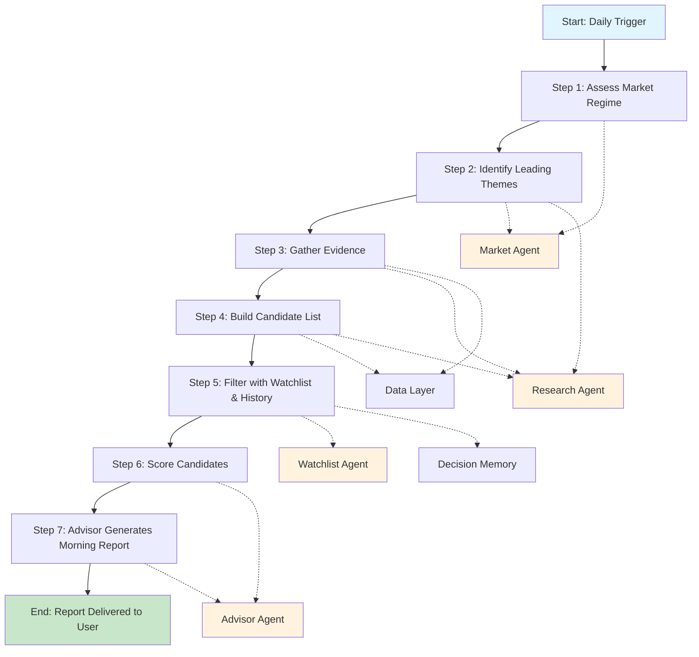
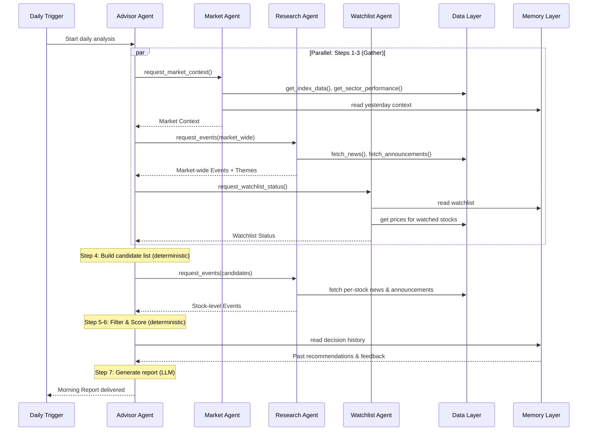

# Decision Flow 〞 AI Investment Mentor

This document describes the step-by-step process by which the AI Investment Mentor narrows the A-share universe from approximately 5000 stocks to a single morning report with 5每10 explainable candidates and one deep-dive pick.

## Flow Overview

Each step below describes: what happens, which Agent or component does the work, what the input is, and what the output is.

---

## Step 1: Assess Market Regime

**What happens**: Determine what kind of market we are in today. Is money flowing in or out? Are we in a risk-on or risk-off environment? Which broad direction is the market pointing?

**Done by**: Market Agent

**Input**: Index OHLCV data (Shanghai Composite, Shenzhen Component, ChiNext, STAR 50), sector-level returns, north-bound capital flow, SHIBOR rates, yesterday Market Context from Memory

**Output**: Market Context object containing regime classification, confidence score, leading/lagging sectors, risk flags, and a macro narrative

**Decision logic**: Deterministic rule engine runs first (breadth thresholds, volume ratios, sector dispersion). If confidence is below 0.6, LLM is invoked with structured evidence to produce final classification. This ensures we do not waste an LLM call on an obvious trend day but get depth when the signal is ambiguous.

**Edge cases**:
- Holiday-shortened week with thin volume ↙ flag as "low conviction" and widen candidate criteria
- Major index gap (overnight shock) ↙ treat as regime transition day, increase narrative weight
- Data source partially unavailable ↙ produce best-effort context with "data degraded" flag

---

## Step 2: Identify Leading Themes

**What happens**: Within the current regime, which specific themes or sectors have momentum? This is not about picking stocks 〞 it is about narrowing the hunting ground from "whole market" to "interesting neighborhoods."

**Done by**: Market Agent (sector momentum) + Research Agent (narrative themes from news/policy)

**Input**: Sector performance data, Research Agent market-wide event summary, policy signals

**Output**: A ranked list of 2每4 themes, each with:
- Theme name and sector mapping
- Supporting evidence (price momentum, volume confirmation, policy catalyst, news volume)
- Theme strength score (0每10)

**Decision logic**: Themes are identified by intersecting quantitative signals (sector outperformance + breadth expansion) with qualitative signals (policy announcements, earnings cycle, news sentiment). A theme with only price momentum and no narrative catalyst is flagged as "technically driven, lower conviction."

**Edge cases**:
- No clear themes ↙ market is directionless. Candidate pool widens to include defensive and dividend stocks
- Single dominant theme ↙ risk of overcrowding. Flag in report
- Theme rotation detected (yesterday leader is today laggard) ↙ signal regime shift, reduce position sizing suggestion

---

## Step 3: Gather Evidence

**What happens**: For each identified theme, collect structured evidence about the stocks within those themes. This is the data-gathering step 〞 no filtering yet, just collection.

**Done by**: Research Agent + Data Layer

**Input**: Theme-sector mapping from Step 2, stock universe scoped to theme-relevant sectors

**Output**: For each stock in scope:
- Recent news events (classified by type and sentiment)
- Latest company announcements (earnings guidance, material events, insider transactions)
- Basic fundamental snapshot (PE, PB, revenue growth trend, ROE)
- Technical snapshot (price relative to moving averages, volume trend, relative strength)

**Decision logic**: This step is pure data aggregation. The Research Agent classifies and summarizes unstructured information. The Data Layer provides structured market and fundamental data. No ranking or filtering happens here.

**Edge cases**:
- Stock with zero recent news ↙ not a negative signal. Flag as "no news catalyst" and let scoring handle it
- Conflicting signals (positive earnings guidance but negative news sentiment) ↙ flag both, do not resolve
- Newly listed stock with insufficient history ↙ flag as "limited data," score conservatively

---

## Step 4: Build Candidate List

**What happens**: Narrow the evidence pool from "all stocks in relevant sectors" to a manageable candidate list. This is the first filtering pass.

**Done by**: Advisor Agent (orchestration) with deterministic filtering logic

**Input**: Evidence pool from Step 3, Market Context from Step 1

**Output**: A candidate list of 20每50 stocks that pass basic filters

**Filters applied** (V1, all deterministic):
1. **Market cap**: exclude stocks below 5 billion RMB (liquidity floor)
2. **Trading status**: exclude suspended stocks, ST/*ST stocks
3. **Volume**: exclude stocks with daily turnover below 50 million RMB (illiquid)
4. **New listing**: exclude IPOs within first 60 trading days (insufficient history)
5. **Theme relevance**: stock must belong to at least one identified theme-sector
6. **Daily move**: exclude limit-down stocks (no catching falling knives)

**Edge cases**:
- All stocks filtered out ↙ relax market cap floor to 2 billion, report "thin candidate pool" warning
- Entire sector limit-down (policy shock) ↙ exclude sector entirely, note in report
- Candidate pool below 10 ↙ skip Step 5 filtering, score all remaining candidates directly

---

### Concurrency & Caching Note

Step 4's stock-level Research Agent calls are the most latency-sensitive path in the pipeline. With 50 candidates, naive sequential fetching produces 50 sequential API calls.

**V1 mitigation:**
- Cap concurrent news fetches at 10 (semaphore or `asyncio.gather` with limit)
- Cache per-stock news results within a single daily run (no duplicate fetches if a stock appears in multiple themes)
- Timeout per fetch: 10 seconds. After timeout, proceed without that stock's news 〞 score with available data
- Typical pipeline latency target: < 120 seconds end-to-end for the morning report

**V2 enhancements:** Pre-fetch all sector news during Step 2, carry results forward instead of re-fetching. Add a persistent cache layer in the Component Layer for news articles valid within the same trading day.

---

## Step 5: Filter with Watchlist & History

**What happens**: Overlay the user personal context. Prioritize stocks the user already tracks. Eliminate stocks recently reviewed and rejected. This makes the report personally relevant.

**Done by**: Watchlist Agent + Decision Memory lookup

**Input**: Candidate list from Step 4, user watchlist from Memory, decision history from Memory

**Output**: Prioritized candidate list with watchlist status tags and historical context

**Filtering logic**:
1. **Watchlist boost**: Stocks on the user watchlist get priority 〞 they stay in the list regardless of other filters
2. **Recent review check**: If the Advisor recommended a stock in the last 5 trading days and the thesis has not changed materially, flag as "previously reviewed" rather than re-recommending at full weight
3. **User rejection history**: If the user explicitly dismissed a stock in the last 20 trading days, exclude it unless a new material catalyst exists
4. **Watchlist expansion**: If a stock appears in the top candidates for 3+ consecutive days but is not on the watchlist, recommend adding it

**Edge cases**:
- Empty watchlist (new user) ↙ skip watchlist boost, note guidance in report
- Entire watchlist outside current themes ↙ still include watched stocks with "against-theme" flag, user may have contrarian reasons
- Watchlist stock suspended ↙ flag and recommend review

---

## Step 6: Score Candidates

**What happens**: Rank the filtered candidate list with a transparent, multi-factor scoring model. This is where the system forms an opinion about which stocks deserve the user attention.

**Done by**: Advisor Agent scoring engine (deterministic)

**Input**: Filtered candidate list with evidence, Market Context for regime-appropriate weight adjustment

**Output**: Scored and ranked candidate list with score breakdowns

**Scoring dimensions** (V1):

| Factor | Weight (normal) | Weight (risk-on) | Weight (risk-off) | Data source |
|---|---|---|---|---|
| News sentiment & recency | 25% | 30% | 15% | Research Agent |
| Technical momentum | 25% | 30% | 10% | Data Layer |
| Fundamental quality | 20% | 15% | 30% | Data Layer |
| Capital flow (institutional) | 15% | 15% | 20% | Data Layer |
| Watchlist priority | 10% | 5% | 15% | Watchlist Agent |
| Theme alignment | 5% | 5% | 10% | Market Agent |

Weights shift by regime:
- **Risk-on**: Momentum and news matter more. Fundamentals matter less. Stocks moving fast on good news score highest.
- **Risk-off**: Fundamentals and capital flow matter more. Momentum matters less. Quality and institutional support score highest.
- **Neutral**: Balanced weights as shown in "normal" column.

**Scoring method**: Each factor is scored 0每10. Final score is weighted sum. The score breakdown is preserved and presented in the report 〞 the user sees *why* a stock scored well, not just the final number.

**Edge cases**:
- Missing data for a factor ↙ score that factor at 5 (neutral), flag as "incomplete data"
- All candidates score below 6 ↙ market is difficult. Report honestly: "low conviction environment, consider reducing position size"
- Single stock scores dramatically above rest ↙ check for data error (e.g., one outlier news event inflating sentiment). If valid, that is the deep-dive pick

---

## Step 7: Advisor Generates Morning Report

**What happens**: Turn the scored candidate list and all accumulated evidence into a human-readable morning report with a learning point. This is the only step where an LLM is used for narrative generation 〞 everything before this is deterministic or structured extraction.

**Done by**: Advisor Agent (LLM-powered narrative generation)

**Input**: Scored candidate list with full evidence chains, Market Context, Watchlist Status, Decision History

**Output**: Morning Report (JSON structure defined in Agent Design) rendered for user consumption

**Narrative generation rules**:
1. Market summary paragraph: 2每3 sentences synthesizing regime, themes, and key risk to watch
2. Candidate entries: one paragraph per candidate. Lead with the thesis, follow with evidence. End with risks
3. Deep dive: the most important section. Business context, catalyst, valuation, risk scenario, invalidation condition
4. Learning point: mandatory. Must teach one investment concept illustrated by today analysis

**Fallback rule**: If the LLM narrative generation fails (timeout, rate limit, error), fall back to a structured bullet-point report. The user still gets the data 〞 just without the polished prose.

**Edge cases**:
- LLM produces hallucinated facts ↙ structured evidence is the source of truth. If narrative contradicts evidence, evidence wins. This is enforced by generating narrative from structured data, not from raw text
- Report too long (>10 candidates) ↙ cap at 10, note "additional candidates available on request"
- User feedback from previous report ↙ incorporate into today learning point if relevant

---

## Processing Sequence Diagram

---

## Decision Principles (Recurring)

These principles apply across all steps and are codified here so future phases can reference them:

1. **Deterministic before LLM.** If a rule can make the decision, use the rule. LLM is for synthesis and explanation, not for filtering or scoring.

2. **Evidence before opinion.** Every conclusion in the output must trace back to a specific data point or structured analysis. No "market feels heavy" without a breadth or volume number behind it.

3. **Degrade gracefully.** If a data source or Agent fails, produce partial output rather than no output. Flag what is missing so the user can calibrate trust.

4. **The user is the decision-maker.** The system recommends and explains. It never executes, never allocates, never presumes to know the user risk tolerance better than the user does.

5. **Transparency is the product.** A recommendation with an explained evidence chain is more valuable than a higher-accuracy black-box prediction. The user learns from the process.

