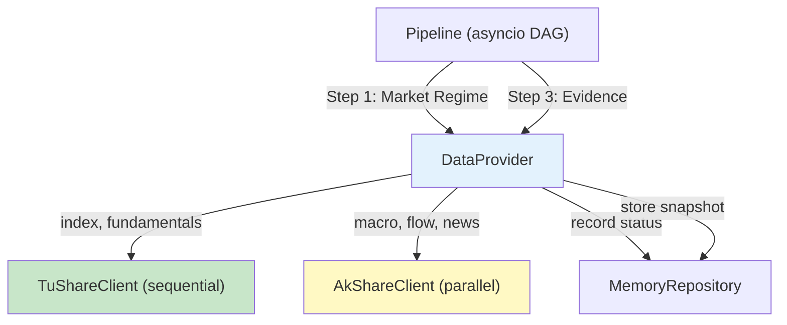
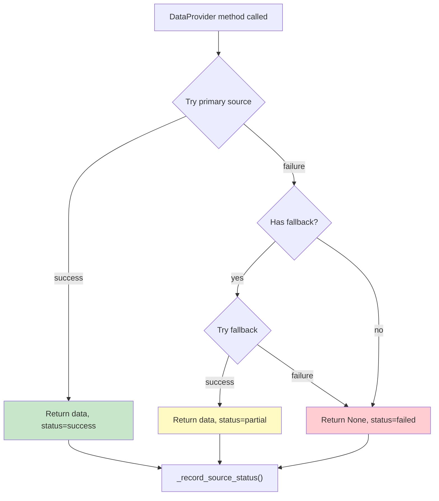

# Data Layer Design — AI Investment Mentor

This document describes the architecture of the data layer: what data sources exist, how they are accessed, what Components abstract them, and how each future Agent''s data requirements map to the layer.

## 1. Role in the System

The data layer sits between the Pipeline (Phase 4) and the external world. It is the **only** path through which any Agent or Component accesses market data, fundamental data, macro indicators, capital flow data, or news. No Agent calls AkShare or TuShare directly.

```
┌──────────────────────────────────────────┐
│              Pipeline (asyncio DAG)       │
├──────────────────────────────────────────┤
│  Market Agent │ Research Agent │ Advisor  │
├──────────────────────────────────────────┤
│            DataProvider (Component)       │
│  ┌──────────────┐  ┌──────────────┐      │
│  │ AkShareClient │  │TuShareClient │      │
│  └──────┬───────┘  └──────┬───────┘      │
├─────────┼─────────────────┼──────────────┤
│         v                 v              │
│   AkShare API        TuShare API         │
│   (free, scraped)    (free tier, REST)   │
└──────────────────────────────────────────┘
```

## 2. Data Source Mapping

### 2.1 TuShare — Stable Structured Data

| Endpoint | Data Provided | Used By |
|---|---|---|
| `daily()` | Daily OHLCV, volume, trading status | Market Agent, candidate filtering |
| `stock_basic()` | Stock list: code, name, industry, market cap, list date | Candidate filtering (Step 4) |
| `income()` | Income statements (revenue, net profit, growth) | Scoring engine (Step 6) |
| `balancesheet()` | Balance sheets (assets, liabilities, equity) | Scoring engine |
| `cashflow()` | Cash flow statements | Scoring engine |
| `daily_basic()` | Daily valuation: PE, PB, total MV, turnover rate | Fundamental snapshot |
| `index_daily()` | Index OHLCV for Shanghai/Shenzhen/ChiNext/STAR | Market Agent (Step 1) |

**Rate limiting**: TuShare free tier allows ~200–500 calls/day. Each `daily()` call can return all 5000+ A-share stocks for one date — one call, not 5000. Similarly, `stock_basic()` returns the full stock list in one call. Our daily pipeline budget: ~10 calls for market/index data + ~5 for fundamentals + ~5 for sector data ≈ 20–30 TuShare calls per run. Safe headroom.

**Concurrency**: TuShare is not designed for parallel access. All calls go through a single sequential queue (internal `asyncio.Semaphore(1)`). This is not a bottleneck in practice because TuShare calls are batched.

### 2.2 AkShare — Breadth Coverage

| Endpoint | Data Provided | Used By |
|---|---|---|
| `stock_zh_index_daily()` | A-share index OHLCV | Market Agent (TuShare fallback) |
| `stock_board_industry_summary_ths()` | Sector performance by industry | Market Agent (Step 2) |
| `macro_china_shibor_all()` | SHIBOR rates (all tenors) | Market Agent (Step 1) |
| `macro_china_pmi()` | Manufacturing PMI | Market Agent |
| `macro_china_cpi_yearly()` | Consumer Price Index | Market Agent |
| `stock_hsgt_north_net_flow_in_em()` | Northbound net flow daily | Market Agent |
| `stock_news_em()` | Per-stock news from East Money | Research Agent (Step 3) |
| `stock_info_sh_name_code()` | Exchange-listed stock announcements | Research Agent |

**Concurrency**: AkShare hits different upstream websites per endpoint. Parallel calls are safe. Internal `asyncio.Semaphore(10)` caps concurrent fetches to avoid rate-limiting by upstream servers.

**Fragility**: AkShare scrapes unofficial endpoints. When upstream websites change, AkShare breaks. Mitigation: every AkShare call is wrapped in a try/except that returns partial data or a structured error, never an unhandled exception.

## 3. Component Architecture

### 3.1 Directory Structure

```
src/data/
  __init__.py
  ak_share_client.py    # AkShareClient — wraps akshare, returns dicts
  tu_share_client.py    # TuShareClient — wraps tushare, handles token + rate limiting
  provider.py           # DataProvider — unified public interface
```

### 3.2 TuShareClient

```python
class TuShareClient:
    def __init__(self, token: str):
        """Initialize with TuShare API token. Does NOT connect."""

    async def get_daily(self, trade_date: str) -> list[dict]:
        """Return OHLCV + trading status for all A-share stocks on a given date.
        Returns list of {ts_code, open, high, low, close, vol, amount, ...}"""

    async def get_stock_basic(self) -> list[dict]:
        """Return full stock list: {ts_code, name, industry, market, list_date}"""

    async def get_daily_basic(self, trade_date: str, ts_codes: list[str] | None = None) -> list[dict]:
        """Return daily valuation metrics: {ts_code, pe, pb, total_mv, turnover_rate}"""

    async def get_income(self, ts_codes: list[str], period: str) -> list[dict]:
        """Return income statement data for specified stocks and reporting period."""

    async def get_index_daily(self, ts_code: str, start_date: str, end_date: str) -> list[dict]:
        """Return index OHLCV for a single index over a date range."""
```

**Internal behavior**: All methods acquire a `self._semaphore` before making the HTTP call, ensuring sequential access. Each call has a 15-second timeout. On failure, raises `DataFetchError` with the source name and original exception chained.

### 3.3 AkShareClient

```python
class AkShareClient:
    def __init__(self):
        """No auth needed. Does NOT connect."""

    async def get_index_daily(self, symbol: str) -> list[dict]:
        """Return index OHLCV. Falls back to TuShare if AkShare is unavailable."""

    async def get_sector_performance(self) -> list[dict]:
        """Return sector-level returns: {sector_name, pct_change, leading_stocks}"""

    async def get_shibor(self) -> dict:
        """Return latest SHIBOR rates: {overnight, 1w, 2w, 1m, ...}"""

    async def get_pmi(self) -> float | None:
        """Return latest manufacturing PMI value."""

    async def get_cpi(self) -> float | None:
        """Return latest CPI year-over-year change."""

    async def get_northbound_flow(self) -> dict:
        """Return today northbound net flow: {sh_net, sz_net, total_net}"""

    async def get_stock_news(self, stock_code: str, limit: int = 20) -> list[dict]:
        """Return recent news articles: {title, content, publish_time, source}"""

    async def get_announcements(self, stock_code: str, limit: int = 20) -> list[dict]:
        """Return recent announcements: {title, type, publish_date, summary}"""
```

**Internal behavior**: Each call runs inside a `run_in_executor` (ThreadPoolExecutor) to avoid blocking the asyncio event loop, since AkShare underlying `requests` calls are synchronous. Wrapped in try/except — failures return empty results with a log warning, never an exception.

### 3.4 DataProvider

```python
class DataProvider:
    """Unified data access for all Agents. Delegates to TuShareClient and AkShareClient."""

    def __init__(self, tu_share_client: TuShareClient, ak_share_client: AkShareClient,
                 memory_repo: MemoryRepository):
        """Dependency injection — clients and memory are provided, not created."""

    # Market Data
    async def get_market_snapshot(self, date: str) -> dict
    async def get_index_data(self, start_date: str, end_date: str) -> list[dict]
    async def get_sector_performance(self) -> list[dict]

    # Fundamental Data
    async def get_fundamental_snapshot(self, ts_codes: list[str], date: str) -> list[dict]
    async def get_stock_basic_info(self) -> list[dict]

    # Macro Data
    async def get_macro_indicators(self) -> dict

    # Capital Flow
    async def get_northbound_flow(self) -> dict

    # News & Announcements
    async def get_stock_news(self, stock_code: str, limit: int = 20) -> list[dict]
    async def get_announcements(self, stock_code: str, limit: int = 20) -> list[dict]

    # Status
    async def get_source_status(self, date: str) -> list[dict]
    async def _record_source_status(self, source: str, status: str, error: str | None) -> None
```

**Internal behavior**: DataProvider orchestrates calls across both clients. For example, `get_market_snapshot()` calls TuShare for index data, AkShare for macro indicators, and AkShare for northbound flow — potentially in parallel — then assembles a single `dict` result. Every public method internally wraps client calls in try/except and records source status via `_record_source_status()`.

**Graceful degradation example**:

```
get_market_snapshot("2026-07-06"):
    tu_daily  -> success -> index_ohlcv populated
    ak_macro  -> success -> shibor, pmi populated
    ak_flow   -> timeout -> northbound = None, data_quality = "degraded"
    Result returned with partial data. Pipeline continues.
```

## 4. Database Extension: `data_source_status`

Phase 3 `market_snapshots` table already stores the *output* of the Market Agent daily work. The `data_source_status` table stores the *operational* status of the underlying data sources:

```sql
CREATE TABLE IF NOT EXISTS data_source_status (
    id INTEGER PRIMARY KEY AUTOINCREMENT,
    date TEXT NOT NULL,
    source TEXT NOT NULL,          -- 'tushare' | 'akshare'
    status TEXT NOT NULL,          -- 'success' | 'partial' | 'failed'
    error_message TEXT,
    created_at TEXT NOT NULL
)
```

This table is not consumed by Agents. It exists for debugging and observability — answering "why was yesterday confidence low?" by checking whether TuShare was partially unavailable.

## 5. Data Flow Diagrams

### 5.1 Daily Pipeline Data Flow



### 5.2 Graceful Degradation Flow



## 6. Per-Agent Data Requirements

This section defines what each future Agent (Phases 8–11) needs from the DataProvider. It acts as a contract — when we implement Agents, they call these methods and only these methods.

### Market Agent (Phase 8)

| Need | DataProvider Method | Source |
|---|---|---|
| Index OHLCV (Shanghai, Shenzhen, ChiNext, STAR 50) | `get_index_data()` | TuShare -> AkShare |
| Sector performance | `get_sector_performance()` | AkShare |
| SHIBOR overnight | `get_macro_indicators()` -> `shibor_overnight` | AkShare |
| PMI | `get_macro_indicators()` -> `pmi` | AkShare |
| CPI | `get_macro_indicators()` -> `cpi` | AkShare |
| Northbound net flow | `get_northbound_flow()` | AkShare |
| Yesterday market context | MemoryRepository | SQLite |

### Research Agent (Phase 9)

| Need | DataProvider Method | Source |
|---|---|---|
| Stock-level news | `get_stock_news(code)` | AkShare |
| Stock-level announcements | `get_announcements(code)` | AkShare |
| Market-wide policy signals | `get_stock_news()` with market-level keywords | AkShare |
| Recent decision history (for context) | MemoryRepository | SQLite |

### Advisor Agent (Phase 10)

| Need | DataProvider Method | Source |
|---|---|---|
| Fundamental snapshot (PE, PB, ROE, growth) | `get_fundamental_snapshot()` | TuShare |
| Stock basic info (name, industry, market cap) | `get_stock_basic_info()` | TuShare |
| Candidate screening data | `get_market_snapshot()` + `get_fundamental_snapshot()` | Both |
| Decision history | MemoryRepository | SQLite |
| Source status (for report notes) | `get_source_status()` | SQLite |

### Stock Selection Agent (Phase 11)

| Need | DataProvider Method | Source |
|---|---|---|
| All fundamental metrics | `get_fundamental_snapshot()` | TuShare |
| All market data | `get_market_snapshot()` | Both |
| News sentiment input | `get_stock_news()` | AkShare |
| Watchlist context | MemoryRepository | SQLite |

## 7. Error Handling Matrix

| Scenario | AkShare behavior | TuShare behavior | DataProvider result |
|---|---|---|---|
| Normal operation | Returns data | Returns data | Full result, `data_quality='full'` |
| AkShare partial (e.g., news endpoint down) | Returns `[]` for news | Normal | Result with empty news, `data_quality='degraded'` |
| AkShare total failure | All calls return `[]` | Normal | No news/flow/macro. Market regime from TuShare still works |
| TuShare partial (e.g., fundamentals down) | Normal | Returns `[]` for fundamentals | Scoring runs without fundamentals, `data_quality='degraded'` |
| TuShare total failure | Normal | All calls return `[]` | Market Agent uses AkShare for index data. No fundamentals at all |
| Both down | All calls return `[]` | All calls return `[]` | `get_market_snapshot()` returns minimal dict with `data_quality='failed'`. Pipeline decides whether to abort |
| AkShare import fails | `AkShareClient.__init__` raises | Normal | DataProvider catches at init, sets `_ak_available = False`. All AkShare calls return `[]` |
| TuShare token invalid | Normal | `TuShareClient.__init__` warns | DataProvider catches, sets `_ts_available = False`. Only AkShare data available |

## 8. Configuration

Data layer configuration extends the existing `config.py` (Phase 4):

```ini
[data]
tushare_token = ${TUSHARE_TOKEN}
tushare_call_timeout = 15
akshare_call_timeout = 30
akshare_parallel_limit = 10
news_default_limit = 20
```

`TUSHARE_TOKEN` is read from environment variable. No AkShare token needed.

## 9. V2 Evolution

- **Caching layer**: On-disk cache (SQLite or Parquet) for daily data — enables intraday re-runs and backtesting without re-fetching
- **Async AkShare**: If AkShare adds async support, remove `run_in_executor` wrapper
- **Progressive enhancement**: Add Wind/Bloomberg connectors if the user moves to institutional data
- **Split DataProvider**: If Phase 8–11 reveals that agents need different fetch strategies, split into category-specific providers
