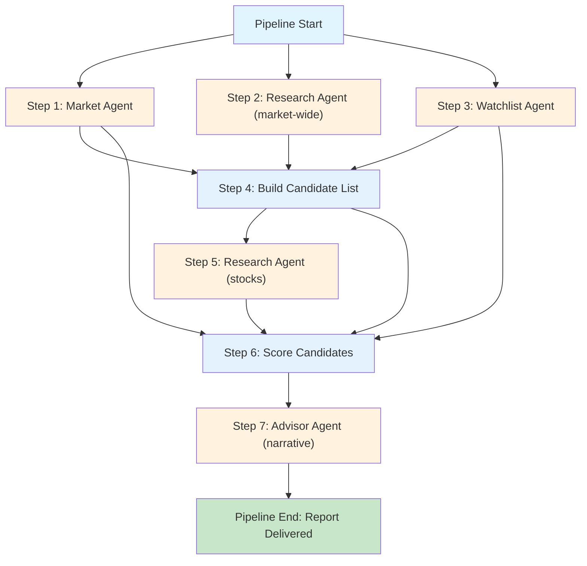

# Orchestrator Design ！ AI Investment Mentor

This document defines how the AI Investment Mentor system runs at runtime: the Pipeline that triggers daily analysis, manages Agent lifecycles, enforces error boundaries, and delivers the morning report to the user.

## Why an Orchestrator?

The architecture documents describe *what* each Agent does. The orchestrator describes *how* they actually run together. Without it, we have four well-defined Agents that nobody calls.

The orchestrator is responsible for:

1. **Scheduling** ！ triggering the daily pipeline (cron, CLI, or long-running process)
2. **Wiring** ！ creating shared resources (Config, MemoryRepository) and injecting them into Agents
3. **Execution** ！ running the DAG: parallel where possible, sequential where dependent
4. **Error handling** ！ enforcing per-step severity and deciding whether to continue or abort
5. **Delivery** ！ writing the final report to the user

## Orchestration Pattern: DAG-based Pipeline

The orchestrator uses a lightweight Directed Acyclic Graph executor. Steps declare their dependencies. The executor runs independent steps in parallel and waits at join points.

### The Pipeline DAG



Steps 1-3 run in parallel (no dependencies). Step 4 waits for all three. Step 5 depends only on Step 4. Step 6 depends on Steps 4, 1, and 3 (needs candidate list, market context, and watchlist). Step 7 depends on Step 6.

### What happens at each step

| Step | Agent | Runs When | Parallel? | Severity |
|---|---|---|---|---|
| 1 | Market Agent | Pipeline start | Yes (with 2, 3) | Critical |
| 2 | Research Agent (market-wide) | Pipeline start | Yes (with 1, 3) | Warning |
| 3 | Watchlist Agent | Pipeline start | Yes (with 1, 2) | Warning |
| 4 | Build Candidate List (deterministic) | After 1, 2, 3 | No | Critical |
| 5 | Research Agent (stocks) | After 4 | No | Warning |
| 6 | Score Candidates (deterministic) | After 4, 1, 3 | No | Critical |
| 7 | Advisor Agent (LLM narrative) | After 6 | No | Critical |

**Parallelism note**: Steps 1-3 run concurrently via `asyncio.gather`. Steps 4-7 are sequential because each depends on the previous step's output. This is correct for V1 ！ the DAG is wide at the start (gather evidence) and narrow at the end (synthesize and present).

## Agent Lifecycle

Every Agent follows the same lifecycle, enforced by the Pipeline:

```
Instantiate ★ Receive Dependencies ★ Run ★ Produce Result
```

### Instantiation

The Pipeline creates each Agent once, before execution begins:

```python
config = load_config()
memory = MemoryRepository(config.db_path)

market = MarketAgent(config, memory)
research = ResearchAgent(config, memory)
watchlist = WatchlistAgent(config, memory)
advisor = AdvisorAgent(config, memory)
```

Agents are **not created per-run** ！ they are created once at startup and reused. This avoids redundant initialization (LLM client connections, tool setup). Agents are stateless between runs except for what Memory persists.

### Lifecycle rules

1. **Config is frozen and read-only.** Agents cannot modify configuration at runtime
2. **MemoryRepository is shared.** All Agents share one MemoryRepository instance with one connection pool
3. **Tools are Agent-owned.** Each Agent creates its own Tools from the shared Config
4. **Agents do not know about each other.** The Pipeline wires inputs and outputs ！ no Agent receives a reference to another Agent
5. **Agents do not self-trigger.** The Pipeline decides when each Agent runs

### The Agent.run() contract

Every Agent must expose a single entry point:

```python
class Agent(ABC):
    @abstractmethod
    async def run(self, **kwargs) -> AgentResult:
        """Execute this Agent's core logic.
        Returns AgentResult with status and data.
        May raise AgentError for unexpected failures."""
```

`AgentResult` is a simple container:

```python
@dataclass
class AgentResult:
    status: str       # "ok" | "degraded" | "failed"
    data: dict        # Structured output (Agent-specific schema)
    errors: list[str] # Error messages if degraded or failed
    warnings: list[str]  # Non-fatal issues
```

## Error Handling: Per-Step Severity

The Pipeline enforces a severity model at each step. This is the mechanism that turns "degrade gracefully" from a principle into code.

### Severity levels

| Level | Meaning | On Failure |
|---|---|---|
| Critical | Pipeline cannot produce meaningful output without this step | Retry once. If still failed, **abort** the pipeline |
| Warning | Step provides valuable but non-essential data | Retry once. If still failed, **continue with degraded flag** |

### Per-step severity table

| Step | Severity | Retry? | On Failure |
|---|---|---|---|
| 1. Market Agent | Critical | 1 retry, 5s delay | Abort pipeline. Emit error report: "Market data unavailable." |
| 2. Research Agent (market-wide) | Warning | 1 retry, 3s delay | Continue. Candidates built without market-wide news. |
| 3. Watchlist Agent | Warning | 1 retry, 3s delay | Continue. Report generated without watchlist personalization. |
| 4. Build Candidate List | Critical | None (deterministic) | Abort. This is pure logic ！ if it fails, something is broken. |
| 5. Research Agent (stocks) | Warning | 1 retry, 3s delay | Continue. Candidates scored without stock-level news evidence. |
| 6. Score Candidates | Critical | None (deterministic) | Abort. No scores means no report. |
| 7. Advisor Agent (LLM) | Critical | 1 retry, 5s delay | Fall back to structured bullet report without narrative. Degraded, not aborted. |

### Abort vs Degrade

- **Abort**: Pipeline stops immediately. The user receives an error message: what failed, why, and when to expect the next attempt
- **Degrade**: Pipeline continues. The final report includes a "Data Quality" section listing which steps were degraded and what impact it has on confidence

### Error recovery: automatic retry

The Pipeline retries failed steps exactly once. Between retries, it waits 3-5 seconds for transient failures (rate limits, network blips). If the retry also fails, the severity table dictates the outcome.

No exponential backoff. No circuit breakers. That's for production systems with 1000 users. Ours has one user.

## Scheduling

V1 supports two trigger modes, selectable via Config:

### Mode 1: CLI (default for development)

```bash
python src/main.py --run-morning-report
```

The user runs it manually. No scheduling infrastructure needed. This is the mode for development and testing ！ every pipeline run is explicit and observable.

### Mode 2: Cron / Task Scheduler (for daily use)

The user configures their operating system to run `python src/main.py --run-morning-report` at 8:30 AM on trading days. The Pipeline does not contain a scheduler ！ it is invoked by the OS.

Why not a long-running process with an internal timer? Because:
- A long-running process that does nothing for 23.5 hours is a waste of memory
- An OS scheduler (cron on Linux/macOS, Task Scheduler on Windows) is battle-tested and already running
- If the pipeline crashes, the OS scheduler retries it tomorrow ！ no watchdog process needed

### Trading day detection

The Pipeline checks whether today is a trading day before running. On weekends or holidays, it exits cleanly. This is implemented as a simple check (not an Agent):

```python
def is_trading_day(date: date) -> bool:
    # Weekends are never trading days
    if date.weekday() >= 5:
        return False
    # Holiday check against a static list (updated quarterly)
    # V2: query AkShare holiday calendar
    return date not in HOLIDAYS
```

## Pipeline Output

The Pipeline produces two outputs:

### 1. Morning Report (user-facing)

Written to `output/report-YYYY-MM-DD.md` (or printed to stdout in CLI mode). This is the formatted report the user reads.

### 2. Pipeline Log (system-facing)

Written to the logging system (JSON lines). Records every step, its status, timing, and any errors. Example:

```json
{"ts": "2026-07-05T08:30:01", "step": "market_agent", "status": "ok", "duration_ms": 3400}
{"ts": "2026-07-05T08:30:01", "step": "research_agent_market", "status": "degraded", "duration_ms": 2100, "error": "news_api_timeout"}
{"ts": "2026-07-05T08:30:04", "step": "watchlist_agent", "status": "ok", "duration_ms": 1200}
...
{"ts": "2026-07-05T08:30:45", "step": "pipeline", "status": "complete", "total_duration_ms": 44000, "degraded_steps": 1}
```

This log is consumed by the pipeline itself (for "previous run" context) and by V2's performance monitoring.

## Startup Sequence

When the system boots (or the CLI command runs):

1. **Load Config** ！ ConfigLoader reads `.env` and environment. If `LLM_API_KEY` is missing, print error and exit
2. **Initialize Memory** ！ MemoryRepository creates/opens the SQLite database, runs schema setup
3. **Create Agents** ！ Instantiate all four Agents with shared Config and MemoryRepository
4. **Run Pipeline** ！ Execute the DAG
5. **Deliver Report** ！ Write to output file and/or stdout
6. **Exit** ！ Clean shutdown. MemoryRepository closes connections

No warm-up phase. No pre-caching. Cold start is acceptable: first run has no historical Market Memory (yesterday context), so Market Agent produces lower-confidence classification. This is documented behavior.

## Performance Budget (V1)

| Metric | Target | Notes |
|---|---|---|
| Pipeline total duration | < 120 seconds | From trigger to report delivered |
| Step timeouts | 30 seconds per step | After timeout, treated as failure |
| LLM call timeout | 60 seconds | Single retry allowed |
| Memory (RAM) | < 200 MB | SQLite + Python + Agent state |
| Disk (database) | < 50 MB | After 1 year of daily runs |

These are targets, not hard limits. We measure before we optimize.

## What We Do Not Build in V1

- **Real-time or streaming pipeline.** Batch only. Morning report, not intraday
- **Multi-pipeline support.** One pipeline, one trigger. No weekend deep-dive or evening summary (V2)
- **Pipeline pause/resume.** If it crashes, it restarts from scratch tomorrow
- **Web dashboard or API.** Output is a Markdown file and stdout
- **Notification delivery.** No email, Slack, or push. User checks the output file or terminal
