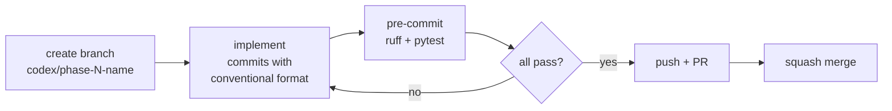

# Phase 7: Project Engineering Standards

Architecture-level summary of all Phase 7 decisions. For implementation steps, see TASK-007.

---

## Directory Layout

```
ai-investment-mentor/
  src/
    agents/             # Agent implementations (Phase 8+)
      market/           # System prompt, agent logic, tests
      research/
      advisor/
      stock_selection/
      watchlist/
    data/               # DataProvider, AkShareClient
    memory/             # MemoryRepository, SQLite
    pipeline/           # Orchestrator DAG
    tools/              # Tool, ToolRegistry, 34 tools
    prompts/            # Shared prompt infrastructure
      __init__.py       # build_agent_prompt(), validate_agent_output()
      base_template.py  # Six-section template builder
  agents/               # Agent spec documents
  components/           # Component spec documents
  docs/
    architecture/       # 01-09 design documents
    LEARNINGS.md        # Cross-phase accumulated wisdom
  adr/                  # ADR-001 through ADR-007
  tasks/                # TASK-001 through TASK-007
  tests/
    unit/               # One file per source module
    integration/        # External dependencies
    prompts/            # Prompt output schema validation
  DEVELOPMENT.md        # Engineering standards
  PROMPTS.md            # Prompt authoring standard
```

Key boundary: `src/agents/` (runtime agent code) is separate from `agents/` (spec documents). Never mix them.

---

## Development Standards Summary

| Rule | Detail | Rationale |
|---|---|---|
| Type hints | All public function signatures | Catches boundary errors before they propagate across agent/tool/component layers |
| Docstrings | Google-style, public only | Agents need clear contracts; private helpers don't need prose |
| Imports | stdlib -> third-party -> local; absolute | Prevents circular dependency headaches in async agent code |
| Line length | 100 chars | Prompt strings and tool descriptions are long |
| Linting | ruff | One tool, fast, replaces flake8+isort+black |
| Type checking | mypy (CI only for V1) | Informational; becomes blocking in V2 |
| Testing | pytest; unit/ + integration/ + prompts/ | Three levels match the three failure modes: logic, integration, LLM output |

---

## Prompt Lifecycle

```
Author -> Version -> Validate (template) -> Test (schema + integration) -> Deploy -> Monitor (version header)
```

Every agent prompt goes through this pipeline. No prompt reaches an agent without a version header. No output model reaches production without schema tests.

### Two-Layer Validation

```
LLM Output -> Pydantic Model (reject if invalid) -> Downstream Agent/Tool
    ^                  ^
    |                  |
  Prompt says         Code enforces
  "this shape"        "this shape"
```

The Pydantic model is the source of truth. The prompt-level format constraint is derived from it via `to_prompt_constraint()`. This eliminates drift between what the prompt asks for and what the code accepts.

---

## Git Workflow



| Rule | Detail |
|---|---|
| Branch | `codex/phase-N-short-description` |
| Commit | `feat:`, `fix:`, `docs:`, `test:`, `refactor:`, `chore:` |
| Before commit | `ruff check` + `pytest tests/unit/` |
| Merge | Squash merge via PR |
| Force push | Only on local feature branches |

---

## Codex Collaboration Cycle

Every phase:

```
1. Concept discussion (this document)
   |
2. Architecture decisions (ADR)
   |
3. Document generation (specs, design docs)
   |
4. plan-eng-review (catches gaps before code)
   |
5. Implementation (TASK file steps)
   |
6. Review (pre-delivery smoke test)
```

### Task quality standard

TASK files must be specific enough for Codex to implement without guessing. This means:
- Exact file paths to create or modify
- Expected function signatures with types
- Test cases that define "done"
- No ambiguous verbs like "consider" or "maybe"

### Living documents

After every phase, update:
- `ROADMAP.md` -- phase status
- `STATE-OF-THE-PROJECT.md` -- current task
- `docs/LEARNINGS.md` -- lessons from this phase

---

## Phase 7 Deliverables

| File | Purpose |
|---|---|
| `ADR-007-project-planning.md` | Architecture decisions |
| `TASK-007-project-standards.md` | Implementation steps |
| `DEVELOPMENT.md` | Engineering standards |
| `PROMPTS.md` | Prompt authoring standard |
| `docs/architecture/09-project-standards.md` | This document |
| `.editorconfig` | TASK-007 Step 4 |
| `pyproject.toml` (updates) | TASK-007 Step 4 |
| `src/prompts/__init__.py` | TASK-007 Step 5 |